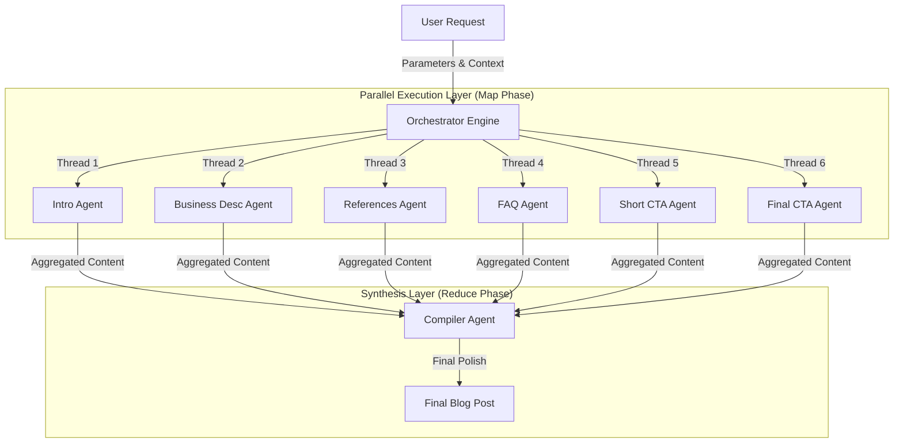

<div align="center">
<h1 align="center">Writer's Block</h1>


<p align="center">
  
</p>
</div>

## 📖 Overview

Writer's Block is an **AI-powered blog generation platform** built on Flask, designed specifically for legal and health content creators. It combines multi-agent AI architecture with PostgreSQL-backed content management to produce SEO-optimized, professionally-written blog posts at scale.

**🌐 Live Demo:** [https://writers-block-weup.onrender.com](https://writers-block-weup.onrender.com)

### Who This Is For
- **Law Firms** - Generate compliant, informative legal blog content
- **Healthcare Providers** - Create educational health and wellness articles  
- **Content Agencies** - Scale high-quality content production efficiently
- **Marketing Teams** - Maintain consistent brand voice across hundreds of articles

### What Makes It Different
✅ **6 Specialized AI Agents** working in parallel for different blog sections  
✅ **Cost-Optimized** - Uses the right model for each task (~$0.04 per blog)  
✅ **Example-Based Learning** - Maintains consistent style by learning from your existing content  
✅ **Full Customization** - 26+ variables for complete control over output  
✅ **Production-Ready** - Built-in retry logic, fallback models, and error handling


## 🏗️ Technical Architecture

The system employs a sophisticated **Map-Reduce** pattern for content generation, orchestrated by a central engine that manages state, concurrency, and error handling.

### Core Components



### 1. The Orchestrator Engine (`orchestrater.py`)
Acts as the central nervous system, handling:
- **Context Injection**: Dynamically builds prompt contexts from user variables (Company Name, Location, etc.).
- **Parallel processing**: Launches 6 concurrent threads using `ThreadPoolExecutor` to generate independent blog sections simultaneously.
- **Error containment**: Isolates failures in individual threads so one failed section doesn't crash the entire pipeline.

### 2. The Agentic Layer (`SingularAgents.py`)
Each section is handled by a specialized agent with built-in reliability features:
- **Automatic Fallback**: If a primary model (e.g., Qwen) fails or times out, the system automatically retries with a backup model (e.g., Llama-3).
- **Exponential Backoff**: Implements smart retries with jitter to handle API rate limits gracefully.
- **Strict Guardrails**: Enforces output formatting to prevent "AI hallucinations" or meta-commentary (e.g., "Here is your text...").

### 3. The Compiler Synthesis (`FullAgents.py`)
The final stage uses a high-intelligence model (DeepSeek-V3 or Llama-4-Maverick) to:
- **Assemble**: Merges disparate sections into a cohesive narrative.
- **Smooth Transitions**: Adds connecting sentences between sections for flow.
- **Format**: Ensures consistent Markdown styling throughout the document.

---

## 🛠️ Technology Stack

### Backend Infrastructure
| Component | Version | Purpose |
|-----------|---------|---------|
| **Python** | 3.12.3+ | Core application language |
| **Flask** | 3.1.0+ | Web framework and API layer |
| **PostgreSQL** | 15.12+ | Primary data store |
| **psycopg2** | Latest | PostgreSQL Python adapter |
| **Gunicorn** | Latest | Production WSGI server |

### AI & LLM Framework
| Component | Purpose |
|-----------|---------|
| **LangChain** | LLM orchestration and chaining |
| **LangGraph** | Multi-agent workflow management |
| **Together AI** | Primary LLM API provider |

### Frontend
| Technology | Use Case |
|------------|----------|
| **HTML5/CSS3** | Structure and responsive design |
| **Vanilla JavaScript** | Interactive UI and AJAX |
| **LocalStorage API** | Client-side state persistence |

---

## ✨ Key Features

### Enterprise-Grade Reliability
The system is engineered for stability using `SingularAgents.py` guardrails:
- **Timeout Protection**: Every agent call is wrapped in a strict 30s timeout window to prevent hanging processes.
- **Smart Retries**: Implements exponential backoff (0.6s base) with jitter to handle transient API failures without crashing.
- **Fallback Models**: Automatically downgrades to backup models if primary inference fails.

### Strict Guardrails
Content generation is controlled by a rigorous system directive:
- **Hallucination Prevention**: Forbidden from inventing legal/medical specifics not in context.
- **Structure Enforcement**: output must be pure Markdown; no JSON, XML, or conversational filler ("Here is your blog").
- **Context Preservation**: Placeholders like `{COMPANY_NAME}` are preserved verbatim for accurate post-processing.

### Core Capabilities
- **Multi-Agent Architecture**: Parallel execution of 6 specialized AI agents.
- **Customizable Prompts**: Template-based system with 26+ configurable variables.
- **PostgreSQL Integration**: Robust database layer for content storage.
- **Progress Tracking**: Real-time monitoring of agent completion status.

### 🤖 AI Agent Roster

Each agent is optimized for a specific content type:

| Agent | Purpose | Token Budget | Output |
|-------|---------|--------------|--------|
| **Intro Writing Agent** | Hook readers with engaging opening paragraphs | 128-640 | Compelling lead-in |
| **Business Description Agent** | Professional company profile | 128-1024 | Brand positioning |
| **FAQ Agent** | Answer common questions | 512-1024 | 5-7 Q&A pairs |
| **Final CTA Agent** | Strong conversion-focused close | 128-512 | Persuasive CTA |
| **Short CTA Agent** | Brief mid-article CTAs | 64-256 | Concise prompts |
| **References Agent** | Citations and sources | 128-512 | Formatted references |
| **Compiler Agent** | Final assembly and polish | 1792-3584 | Complete, cohesive blog |

### 🚧 Roadmap

- [ ] **Multi-Provider Support** - Add Anthropic Claude and Google Gemini options
- [ ] **User Authentication** - Multi-tenant support with role-based access
- [  ] **Advanced Analytics** - Track performance metrics and ROI
- [ ] **SEO Scoring** - Real-time content optimization suggestions  
- [ ] **Template Library** - Pre-built prompts for common blog types

---

## 💰 Pricing & Cost Optimization

Writer's Block uses a **multi-model approach** to optimize both quality and cost. Different AI models are selected for each blog section based on task complexity, ensuring you only pay for the intelligence level you need.

### Model Pricing Overview

All pricing is per **million tokens** (input/output). The system automatically selects the optimal model for each section.

<details open>
<parameter name="summary"><b>📊 Complete Model Pricing Table</b></summary>

| Model | Input/M | Output/M | Primary Use | Token Range | Cost Tier |
|-------|---------|----------|-------------|-------------|-----------|
| **DeepSeek-V3** | $1.25 | $1.25 | Final Blog Assembly | 1792-3584 | 🔴 Premium |
| **Qwen-2.5-72B-Turbo** | $1.20 | $1.20 | Complex FAQs | 512-1024 | 🔴 Premium |
| **DeepSeek-R1** | $0.55 | $2.19 | Engaging Intros | 128-640 | 🟡 High |
| **Qwen/Qwen2.5-7B-Turbo** | $0.30 | $0.30 | Business Descriptions | 128-1024 | 🟢 Standard |
| **Qwen/Qwen3-Next-80B** | $0.15 | $1.50 | Intro Drafting | 128-1024 | 🟢 Standard |
| **openai/gpt-oss-120b** | $0.15 | $0.60 | Final CTAs | 128-512 | 🟢 Standard |
| **Meta-Llama-3-8B** | $0.10 | $0.10 | CTAs | 128-512 | 🔵 Economy |
| **OpenAI/gpt-oss-20B** | $0.05 | $0.20 | References & Citations | 128-512 | 🔵 Economy |
| **google/gemma-3n-E4B** | $0.02 | $0.04 | Short CTAs | 64-256 | 🔵 Economy |
| **Llama-4-Maverick-17B** | $0.27 | $0.85 | Fallback/Testing | Variable | 🟡 High |

</details>

### Cost Breakdown Per Blog

Here's exactly what you'll pay for each section of a typical blog:

| Blog Section | Avg Tokens | Model | Input Cost | Output Cost | **Total** |
|--------------|------------|-------|------------|-------------|-----------|
| Introduction | 400 | Qwen3-Next-80B / DeepSeek-R1 | $0.00006 | $0.0006 | **~$0.0007** |
| Business Description | 600 | Qwen2.5-7B | $0.00018 | $0.00018 | **~$0.0004** |
| FAQs (5-7 questions) | 800 | DeepSeek-V3.1 | $0.00048 | $0.001 | **~$0.0015** |
| Final CTA | 300 | gpt-oss-120b | $0.000045 | $0.00018 | **~$0.0002** |
| Short CTA | 150 | gemma-3n-E4B | $0.000003 | $0.000006 | **~$0.00001** |
| References | 250 | gpt-oss-20B | $0.0000125 | $0.00005 | **~$0.00006** |
| **Final Assembly** | 2500 | **DeepSeek-V3** | **$0.003125** | **$0.003125** | **~$0.0063** |

#### 📌 Bottom Line
**Total Cost Per Blog: $0.04 - $0.05 USD**

> 💡 **Why so cheap?** The multi-model architecture uses expensive models only where needed (final assembly, complex reasoning) and economy models for simpler tasks (CTAs, citations). This "smart routing" reduces costs by up to 95% compared to using GPT-4 for everything.

### Monthly Cost Projections

| Usage Tier | Blogs/Month | Monthly Cost | Annual Cost | Best For |
|------------|-------------|--------------|-------------|----------|
| **Starter** | 10 | $0.40 - $0.50 | ~$5 | Testing, small blogs |
| **Professional** | 50 | $2.00 - $2.50 | ~$25 | Small businesses |
| **Business** | 200 | $8.00 - $10.00 | ~$100 | Content agencies |
| **Enterprise** | 1,000 | $40.00 - $50.00 | ~$500 | Large organizations |
| **Scale** | 10,000 | $400 - $500 | ~$5,000 | Major publishers |

### Cost Variables

Actual costs may vary based on:
- **Prompt Complexity**: More detailed prompts = slightly higher input costs
- **Example Usage**: Fetching more examples increases processing
- **Output Length**: Longer blogs (3000+ words) cost proportionally more
- **Model Availability**: Fallback models may have different pricing

---

## API Endpoint Documentation

### Endpoints

#### 1. Generate Blog Content

**POST** `/api/chat`

Generate blog content using AI agents with customizable prompts and variables.

**Request Body:**
```json
{
  "message": "Generate a blog about car accidents in California",
  "vars": {
    "TITLE": "What to Do After a Car Accident in California",
    "KEYWORDS": "car accident lawyer, personal injury attorney, California accident claim",
    "TEMPERATURE": "0.70",
    "BLOGTYPE": "Legal",
    "COMPANY_NAME": "Smith & Associates Law Firm",
    "CALL_NUMBER": "1-800-555-0123",
    "ADDRESS": "123 Main Street, Los Angeles",
    "STATE_NAME": "California",
    "LINK": "https://smithlawfirm.com",
    "COMPANY_EMPLOYEE": "John Smith",
    "INSERT_INTRO_QUESTION": "What should you do immediately after a car accident?",
    "INSERT_FAQ_QUESTIONS": "How long do I have to file a claim? What damages can I recover?",
    "SOURCE": "California Vehicle Code Section 20001",
    "BLOGFOREXAMPLE": [11, 12, 13],
    "BLOGPART_INTRO": [11, 12],
    "BLOGPART_FINALCTA": [11, 12],
    "BLOGPART_FAQS": [11, 12],
    "BLOGPART_BUSINESSDESC": [11],
    "BLOGPART_SHORTCTA": [11, 12],
    "PROMPT_FULLBLOG": "Write a comprehensive blog post...",
    "PROMPT_INTRO": "Write an engaging introduction...",
    "PROMPT_FINALCTA": "Write a compelling call-to-action...",
    "PROMPT_FULLFAQS": "Generate 5-7 frequently asked questions...",
    "PROMPT_BUSINESSDESC": "Write a professional business description...",
    "PROMPT_REFERENCES": "Integrate the following references...",
    "PROMPT_SHORTCTA": "Write a brief call-to-action..."
  }
}
```

**Response (200 OK):**
```json
{
  "success": true,
  "response": "# What to Do After a Car Accident in California\n\n[Generated blog content...]",
  "timestamp": "2026-01-27T02:30:00",
  "debug_info": {
    "blog_type": "Legal",
    "temperature": "0.70",
    "examples_fetched": {
      "full_blogs": 3,
      "intro_parts": 2,
      "finalcta_parts": 2,
      "faqs_parts": 2,
      "businessdesc_parts": 1,
      "shortcta_parts": 2
    }
  }
}
```

**Error Response (400 Bad Request):**
```json
{
  "success": false,
  "code": "EMPTY_MESSAGE",
  "message": "Message cannot be empty",
  "timestamp": "2026-01-27T02:30:00"
}
```

**Code Examples:**

<details>
<summary><b>cURL</b></summary>

```bash
curl -X POST https://writers-block-weup.onrender.com/api/chat \
  -H "Content-Type: application/json" \
  -d '{
    "message": "Generate a blog about car accidents in California",
    "vars": {
      "TITLE": "What to Do After a Car Accident in California",
      "KEYWORDS": "car accident lawyer, personal injury attorney",
      "TEMPERATURE": "0.70",
      "BLOGTYPE": "Legal",
      "COMPANY_NAME": "Smith & Associates Law Firm",
      "CALL_NUMBER": "1-800-555-0123",
      "ADDRESS": "123 Main Street, Los Angeles",
      "STATE_NAME": "California",
      "LINK": "https://smithlawfirm.com",
      "COMPANY_EMPLOYEE": "John Smith",
      "INSERT_INTRO_QUESTION": "What should you do immediately after a car accident?",
      "INSERT_FAQ_QUESTIONS": "How long do I have to file a claim?",
      "SOURCE": "California Vehicle Code Section 20001",
      "BLOGFOREXAMPLE": [11, 12, 13],
      "BLOGPART_INTRO": [11, 12],
      "BLOGPART_FINALCTA": [11, 12],
      "BLOGPART_FAQS": [11, 12],
      "BLOGPART_BUSINESSDESC": [11],
      "BLOGPART_SHORTCTA": [11, 12],
      "PROMPT_FULLBLOG": "Write a comprehensive blog post...",
      "PROMPT_INTRO": "Write an engaging introduction...",
      "PROMPT_FINALCTA": "Write a compelling call-to-action...",
      "PROMPT_FULLFAQS": "Generate 5-7 frequently asked questions...",
      "PROMPT_BUSINESSDESC": "Write a professional business description...",
      "PROMPT_REFERENCES": "Integrate the following references...",
      "PROMPT_SHORTCTA": "Write a brief call-to-action..."
    }
  }'
```
</details>

<details>
<summary><b>Python</b></summary>

```python
import requests

url = "https://writers-block-weup.onrender.com/api/chat"

payload = {
    "message": "Generate a blog about car accidents in California",
    "vars": {
        "TITLE": "What to Do After a Car Accident in California",
        "KEYWORDS": "car accident lawyer, personal injury attorney",
        "TEMPERATURE": "0.70",
        "BLOGTYPE": "Legal",
        "COMPANY_NAME": "Smith & Associates Law Firm",
        "CALL_NUMBER": "1-800-555-0123",
        "ADDRESS": "123 Main Street, Los Angeles",
        "STATE_NAME": "California",
        "LINK": "https://smithlawfirm.com",
        "COMPANY_EMPLOYEE": "John Smith",
        "INSERT_INTRO_QUESTION": "What should you do immediately after a car accident?",
        "INSERT_FAQ_QUESTIONS": "How long do I have to file a claim?",
        "SOURCE": "California Vehicle Code Section 20001",
        "BLOGFOREXAMPLE": [11, 12, 13],
        "BLOGPART_INTRO": [11, 12],
        "BLOGPART_FINALCTA": [11, 12],
        "BLOGPART_FAQS": [11, 12],
        "BLOGPART_BUSINESSDESC": [11],
        "BLOGPART_SHORTCTA": [11, 12],
        "PROMPT_FULLBLOG": "Write a comprehensive blog post...",
        "PROMPT_INTRO": "Write an engaging introduction...",
        "PROMPT_FINALCTA": "Write a compelling call-to-action...",
        "PROMPT_FULLFAQS": "Generate 5-7 frequently asked questions...",
        "PROMPT_BUSINESSDESC": "Write a professional business description...",
        "PROMPT_REFERENCES": "Integrate the following references...",
        "PROMPT_SHORTCTA": "Write a brief call-to-action..."
    }
}

response = requests.post(url, json=payload)
data = response.json()

if data["success"]:
    print("Blog generated successfully!")
    print(data["response"])
else:
    print(f"Error: {data['message']}")
```
</details>

<details>
<summary><b>JavaScript (Fetch API)</b></summary>

```javascript
const url = "https://writers-block-weup.onrender.com/api/chat";

const payload = {
  message: "Generate a blog about car accidents in California",
  vars: {
    TITLE: "What to Do After a Car Accident in California",
    KEYWORDS: "car accident lawyer, personal injury attorney",
    TEMPERATURE: "0.70",
    BLOGTYPE: "Legal",
    COMPANY_NAME: "Smith & Associates Law Firm",
    CALL_NUMBER: "1-800-555-0123",
    ADDRESS: "123 Main Street, Los Angeles",
    STATE_NAME: "California",
    LINK: "https://smithlawfirm.com",
    COMPANY_EMPLOYEE: "John Smith",
    INSERT_INTRO_QUESTION: "What should you do immediately after a car accident?",
    INSERT_FAQ_QUESTIONS: "How long do I have to file a claim?",
    SOURCE: "California Vehicle Code Section 20001",
    BLOGFOREXAMPLE: [11, 12, 13],
    BLOGPART_INTRO: [11, 12],
    BLOGPART_FINALCTA: [11, 12],
    BLOGPART_FAQS: [11, 12],
    BLOGPART_BUSINESSDESC: [11],
    BLOGPART_SHORTCTA: [11, 12],
    PROMPT_FULLBLOG: "Write a comprehensive blog post...",
    PROMPT_INTRO: "Write an engaging introduction...",
    PROMPT_FINALCTA: "Write a compelling call-to-action...",
    PROMPT_FULLFAQS: "Generate 5-7 frequently asked questions...",
    PROMPT_BUSINESSDESC: "Write a professional business description...",
    PROMPT_REFERENCES: "Integrate the following references...",
    PROMPT_SHORTCTA: "Write a brief call-to-action..."
  }
};

fetch(url, {
  method: "POST",
  headers: {
    "Content-Type": "application/json"
  },
  body: JSON.stringify(payload)
})
  .then(response => response.json())
  .then(data => {
    if (data.success) {
      console.log("Blog generated successfully!");
      console.log(data.response);
    } else {
      console.error(`Error: ${data.message}`);
    }
  })
  .catch(error => console.error("Request failed:", error));
```
</details>

**Common Error Scenarios:**

| Error Code | Cause | Solution |
|------------|-------|----------|
| `EMPTY_MESSAGE` | Message field is empty or missing | Provide a non-empty message in the request |
| `POOL_EXHAUSTED` | Database connection pool is full | Wait and retry, or contact administrator |
| `DB_ERROR` | Database operation failed | Check database connectivity and credentials |
| `CHAT_FAILED` | AI model or orchestration error | Verify API keys and model availability |

---

#### 2. Get Chat History

**GET** `/api/profile/history?date=YYYY-MM-DD`

Retrieve chat history for a specific date.

**Query Parameters:**
- `date` (required) - Date in YYYY-MM-DD format

**Example Request:**
```bash
GET /api/profile/history?date=2026-01-26
```

**Response (200 OK):**
```json
{
  "success": true,
  "code": "OK",
  "date": "2026-01-26",
  "rows": [
    {
      "id": 1,
      "entry": "2026-01-26T05:00:00",
      "entry_date": "2026-01-26",
      "userprompt": "Generate a blog about car accidents",
      "chatresponse": "# Car Accident Guide\n\n[Blog content...]"
    },
    {
      "id": 2,
      "entry": "2026-01-26T06:30:00",
      "entry_date": "2026-01-26",
      "userprompt": "Generate a health blog about nutrition",
      "chatresponse": "# Nutrition Guide\n\n[Blog content...]"
    }
  ]
}
```

**Error Response (404 Not Found):**
```json
{
  "success": false,
  "code": "NO_ROWS_FOR_DATE",
  "message": "No profileHistory rows found for the given entry_date.",
  "requested_date": "2026-01-26",
  "diagnostics": {
    "total_rows": 150,
    "utc_match": 0,
    "pk_match": 0
  },
  "hint": "If utc_match > 0 or pk_match > 0, your data exists but entry_date does not match the selected date due to timezone/date derivation."
}
```

---

#### 3. Get Token Statistics

**GET** `/api/stats/tokens/month`

Get token usage statistics for the current month.

**Response (200 OK):**
```json
{
  "success": true,
  "month_label": "Jan 2026",
  "daily": [
    {
      "day": "01",
      "input_words": 150,
      "output_words": 1200
    },
    {
      "day": "02",
      "input_words": 200,
      "output_words": 1500
    },
    {
      "day": "03",
      "input_words": 180,
      "output_words": 1350
    }
  ]
}
```

---

#### 4. View Database Table

**GET** `/api/db/table/<table_name>`

View contents of a database table (excludes `profilehistory` for privacy).

**Path Parameters:**
- `table_name` (required) - Name of the table to view

**Available Tables:**
- `blogdata` - Complete blog posts
- `blogparts` - Individual blog sections
- `promptdata` - Prompt templates
- `progress` - Daily progress tracking

**Example Request:**
```bash
GET /api/db/table/blogdata
```

**Response (200 OK):**
```json
{
  "success": true,
  "table": {
    "name": "blogdata",
    "columns": ["blogID", "blogText"],
    "row_count": 20,
    "rows": [
      {
        "blogID": 1,
        "blogText": "# Health Blog Example\n\n[Content...]"
      },
      {
        "blogID": 2,
        "blogText": "# Another Health Blog\n\n[Content...]"
      }
    ]
  }
}
```

**Error Response (403 Forbidden):**
```json
{
  "success": false,
  "code": "TABLE_EXCLUDED",
  "message": "This table is excluded from DB views.",
  "table": "profilehistory"
}
```

**Error Response (404 Not Found):**
```json
{
  "success": false,
  "code": "UNKNOWN_TABLE",
  "message": "Table not found.",
  "table": "nonexistent_table",
  "available": ["blogdata", "blogparts", "promptdata", "progress"]
}
```

---

## License

This project is licensed under the MIT License - see the [LICENSE](LICENSE) file for details.

**Important Notice:** This system is designed specifically for blog writing purposes only, for the specific client's needs as they requested.

## Contact

**Ibrahim Hussain**  
Email: [ibrahimbeaconarion@gmail.com](mailto:ibrahimbeaconarion@gmail.com)

**Project Link:** [https://writers-block-weup.onrender.com](https://writers-block-weup.onrender.com)

<div align="center">
